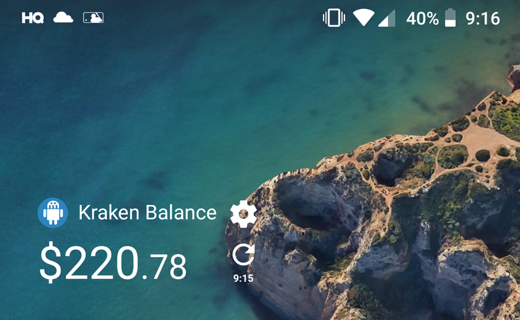
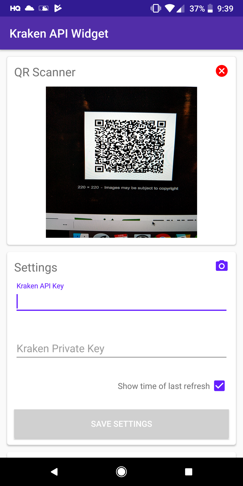

# Kraken-API-Widget

## Description
This project is a widget that is used to display a cryprocurrency balance in CAD from
[Kraken](https://www.kraken.com). The widget makes an API call using Retrofit every 30mins
(or when the refresh button is clicked) to get the account balance. Please feel free to clone
and modify this project however you see fit.

## Features
* Transparent widget displaying total Kraken balance
* Settings screen
* QR code scanner (using [Mobile Vision](https://developers.google.com/vision/)) to quickly enter API keys

 
